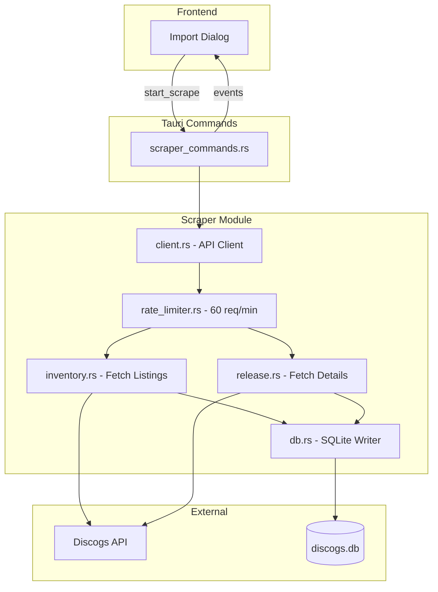

# Discogs API Scraper Implementation

## Architecture Overview



## Module Structure

```
src-tauri/src/
├── lib.rs                      # Add scraper module
├── scraper/
│   ├── mod.rs                  # Public exports
│   ├── client.rs               # Discogs API client with auth
│   ├── rate_limiter.rs         # Token bucket (60 req/min)
│   ├── types.rs                # API response structs
│   ├── inventory.rs            # GET /users/{seller}/inventory
│   ├── release.rs              # GET /releases/{id}
│   ├── db.rs                   # SQLite operations
│   └── runner.rs               # Orchestrates scrape job
└── commands/
    └── scraper_commands.rs     # Tauri commands
```

## Two-Phase Data Flow

**Phase 1: Inventory (Fast - ~40 sec for 3727 items)**

- Fetch paginated inventory (100 items/page)
- Insert basic album data + collection_items immediately
- Emit progress events to frontend

**Phase 2: Enrichment (Background - ~25 min for 1500 releases)**

- Only fetch releases NOT already in DB
- Extract: YouTube videos, genres/styles, tracklist
- Update existing albums with enriched data

## Key Implementation Details

### Authentication

**MVP Phase:** Read `DISCOGS_TOKEN` from `.env` file (already set up)

**Future:** Add settings UI in frontend to configure token

```rust
// client.rs
use std::env;
use dotenvy::dotenv;

const USER_AGENT: &str = "DiscogsPlayer/1.0 +https://github.com/user/discogs-player";

impl DiscogsClient {
    pub fn new() -> Result<Self, Error> {
        dotenv().ok(); // Load .env file
        let token = env::var("DISCOGS_TOKEN")
            .map_err(|_| Error::MissingToken)?;
        // ...
    }

    fn build_request(&self, url: &str) -> RequestBuilder {
        self.client
            .get(url)
            .header("User-Agent", USER_AGENT)
            .header("Authorization", format!("Discogs token={}", self.token))
    }
}
```

### Rate Limiter

Using `governor` crate for token bucket:

```rust
// rate_limiter.rs
use governor::{Quota, RateLimiter};
use std::num::NonZeroU32;

pub fn create_limiter() -> RateLimiter {
    RateLimiter::direct(Quota::per_minute(NonZeroU32::new(60).unwrap()))
}
```

### Database Integration

Leverage existing schema in [src-tauri/discogs.db](src-tauri/discogs.db):

- `albums` table (PK: `discogs_release_id`)
- `collection_items` for seller-specific data
- `youtube_videos` + `album_videos` junction
- `genres`, `styles` with junction tables

## Dependencies to Add

```toml
# src-tauri/Cargo.toml
[dependencies]
reqwest = { version = "0.11", features = ["json"] }
governor = "0.6"
tokio = { version = "1", features = ["full"] }
dotenvy = "0.15"  # Load .env file
```

## Tauri Events for Progress

```rust
// Events emitted to frontend
"scraper:started"      // { seller, total_items }
"scraper:progress"     // { phase, current, total }
"scraper:item_saved"   // { release_id, title }
"scraper:completed"    // { albums_added, albums_updated }
"scraper:error"        // { message }
```

## Testing Strategy

**Test with 100 items first** to verify:

1. API authentication works
2. Rate limiting respects 60 req/min
3. Data correctly maps to database schema
4. YouTube videos extracted properly
5. Genres/styles normalized correctly
6. No duplicate entries created
```rust
// Test command with limit
#[tauri::command]
async fn test_scrape(seller: String, limit: Option<u32>) -> Result<ScrapeResult, Error> {
    let limit = limit.unwrap_or(100); // Default to 100 for testing
    // ...
}
```


**Validation checklist:**

- [ ] Album fields match schema (artist, title, label, etc.)
- [ ] YouTube video IDs extracted correctly
- [ ] Genres/styles linked via junction tables
- [ ] collection_items has correct price/condition
- [ ] No rate limit errors (check X-Discogs-Ratelimit headers)

## Time Estimates

| Phase | Items | Requests | Time (60 req/min) |

|-------|-------|----------|-------------------|

| **Test run** | 100 | ~2 pages + ~80 releases | ~1.5 min |

| Inventory | 3727 | 38 pages | ~40 sec |

| Enrichment | 1500 new | 1500 | ~25 min |

| **Total (first run)** | | | ~26 min |

| **Re-scrape** | 500 new | 543 | ~9 min |